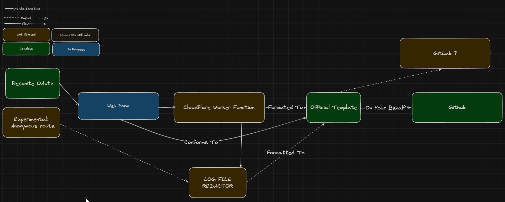

# feedback.resonite.com

> [!IMPORTANT]
> This is a [Creative Day](https://github.com/Yellow-Dog-Man/Resonite-Issues/blob/main/CREATIVE_DAY.md) project. It might not make it to production, It is fun and experimental!

A [Creative Day](https://github.com/Yellow-Dog-Man/Resonite-Issues/blob/main/CREATIVE_DAY.md) project by [ProbablePrime](https://github.com/ProbablePrime), to experiment in feedback systems.

## Goals
- Experimental
- Fun
- Simple
- Minimal

## Non-Goals
- Be released
    - This project will stay in Creative Day mode until it graduates.

## Diagram

## Tech Stack

- [Forms MD](https://github.com/formsmd/formsmd)
- [Clouflare Workers](https://developers.cloudflare.com/workers/)