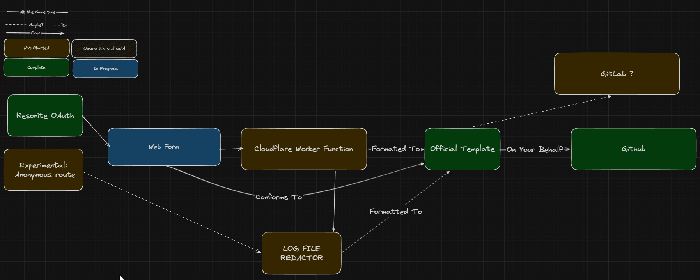

# [feedback.resonite.com](https://feedback.resonite.com)

Simple feedback system for Resonite, focused on generating multi-dimensional, multi-modal feedback from our users.

Check it out live at [feedback.resonite.com](https://feedback.resonite.com)
    
## Diagram


## Features
1. Simple Positive and Negative Feedback
    - Quick, no effort, just "Did you enjoy Resonite today?"
1. Anonymous text based feedback
    - Don't want to make a bug report? Just want to rant. DO IT!
1. Structured Forms aligned to our reporting guidelines
    - We took our GitHub issue reporting forms and converted them into forms
1. Profanity and Email Address Filtering
1. Log File Anonymization

## Experiments

### Multi-Dimensional Feedback


Many platforms have removed options to apply multi-dimensional sentiment. We're exploring that with our [first question](https://github.com/Yellow-Dog-Man/feedback.resonite.com/blob/main/src/main.js#L33-L47). You can also read more about multi-dimensional sentiment on our [issue discussing it](https://github.com/Yellow-Dog-Man/feedback.resonite.com/issues/2)

## Tech Stack

Also see Resources.

- [Forms MD](https://github.com/formsmd/formsmd)
- [Clouflare Workers](https://developers.cloudflare.com/workers/)
- [Vite](https://vite.dev/)
- [Water.css](https://github.com/kognise/water.css)
- [Hono](https://hono.dev/)
- [Mustache](https://mustache.github.io/)
- Cloudflare D1 for Text Feedback
- Cloudflare Analytics Engine for +1, -1 recording
- TODO: Explain the following two items, they are some small items of glue that really make a difference here.
- `vite-ssr-components`
- `@cloudflare/vite-plugin`

## Translations

For the Text-based anonymous feedback, we have employed AI translations. The process is as follows:
1. Detect the language of the incoming text using `tinyld`([NPM](https://www.npmjs.com/package/tinyld)).
2. If non english send to [m2m100-1.2b](https://developers.cloudflare.com/workers-ai/models/m2m100-1.2b/) a model designed for translation
3. Store the translated text, along with the original
4. The original is saved.

## Environment Variables & Configuration

This project uses several Cloudflare environment variables, bindings, and secrets depending on the services being used. Here is the full list of required and optional environment variables:

### 1. Wrangler Variables (`[vars]` in `wrangler.toml`)
* **`ENVIRONMENT`**: The environment mode (e.g., `"production"` or `"development"`).
* **`ACCOUNT_ID`**: Your Cloudflare Account ID. Required if you are querying the Workers Analytics Engine SQL API (used in `scoreService.js`).

### 2. Secrets (Configured via Wrangler or `.dev.vars` for local dev)
Set these using `npx wrangler secret put <NAME>` or inside your local `.dev.vars` file:
* **`GITHUB_APP_ID`** / **`GITHUB_PRIVATE_KEY`**: GitHub App credentials used to submit feedback issues via `githubService.js`. The App must be installed on the issues repo with Issues read & write permission. See [GitHub App](#github-app).
* **`API_TOKEN`**: A Cloudflare API Token with **Account Analytics Read** permissions (required for querying the Workers Analytics Engine SQL API).
* **`TURNSTILE_SECRET_KEY`**: Cloudflare Turnstile secret key used for validating bot protection challenges on form submissions. (Falls back to a test key if not provided).
* **`IP_HASH_SECRET`**: Random secret used to HMAC client IPs before they're used as rate limit keys in KV, so no real IP addresses are stored. Required in production; falls back to a fixed value in dev. Generate one with `openssl rand -hex 32`.

### 3. Cloudflare Bindings (`wrangler.toml`)
* **`ASSETS`**: Static assets binding for serving frontend files from `./dist`.
* **`SCORE`**: Workers Analytics Engine dataset binding (`dataset = "SCORE"`).
* **`DB`**: Cloudflare D1 database binding (`feedback-db`) for storing text feedback.
* **`RATE_LIMIT_KV`**: KV namespace binding for handling rate limits.
* **`BUCKET`**: R2 bucket binding (`feedback-resonite-files`) for storing user-uploaded screenshots and log files.

## GitHub App
Based on: https://github.com/gr2m/cloudflare-worker-github-app-example
1. Create a GitHub App
2. Generate a private key (see the button at the bottom of your GitHub App registration's settings page)
3. You will be prompted to download a `*.pem` file. After download, rename it to `private-key.pem`.
4. Convert the key from the `PKCS#1` format to `PKCS#8` (The WebCrypto API only supports `PKCS#8`):

    ```
    openssl pkcs8 -topk8 -inform PEM -outform PEM -nocrypt -in private-key.pem -out private-key-pkcs8.pem
    ```
5. Write the contents of the new file into the secret `GITHUB_PRIVATE_KEY`:

    ```
    cat private-key-pkcs8.pem | wrangler secret put GITHUB_PRIVATE_KEY
    ```

So 2 ENV's:
1. `GITHUB_APP_ID`
2. `GITHUB_PRIVATE_KEY`

## Scaffolding
TODO: Don't recommend this anymore. Will update with recommended template later
- `npm create vite@latest feedback.resonite.com -- --template vanilla`

## TODO
- [X] Ratelimits
    - Not this:https://developers.cloudflare.com/workers/runtime-apis/bindings/rate-limit/
    - This: https://honohub.dev/docs/rate-limiter/stores/cloudflare
- [X] Turnstile
    - FormsMd, supports recapthca
    - I think we can just turnstile before the form starts though.
    - like: Turnstile -> PASS -> Load Form
- [x] Other Bot Protection, see Cloudflare docs/Panel
    - Will wait for Deploy
- [ ] Resonite Account OAuth
    - Use the OAuth Middleware: https://github.com/honojs/middleware/tree/main/packages/oauth-providers
- [ ] Bans 
    - https://hono.dev/docs/middleware/builtin/ip-restriction
    - I think rate limits and filtering should do enough here.
    - But we'll need some ban functionality.
    - I'll just keep the limits high to start
- [ ] Reports & Outputs
    - [x] Need way to see score
    - Need way to review text feedback
        - Hmm, take each new entry and send it to Discord/Mattermost?
    - You can access the feedback via D1 Dashboard atm
    - Will do more here after launch
- [X] Filtering
    - Do some basic safety filtering for profanity etc.
    - See what Cloudflare has natively.
    - Without this we get racist GH reports >_<
    - https://www.npmjs.com/package/obscenity looks like a good place to start
    - For anything more complex, we'd probably looking at using Cloudflare AI Workers, there's probably a model dedicated to this task. 
- [X] Validation
    - https://zod.dev/
    - Probably overkill for now
- [ ] Blog Posts on Design
    - I REALLY, like this tech stack, felt really nimble but basic enough that I dont need to google docs a lot of the time.
    - I feel like folks, would like this knowledge so if you're interested in a blog post series about how this all works.
    - Let me know, reach me in the funny papers :D.
- [ ] Success Screen
    - Right now, we redirect to github.
    - I want to instead make a success screen that shows "CREATED CLICK HERE TO GO" etc.
- [X] Files via R2
    - [X] Screenshots
    - [X] Log Files
    - [X] I need to test this when its deployed, right now its storing them locally
    - We'll be putting these into an R2 Bucket, people sometimes struggle to upload them to Github
    - Our upload will have a better experience
    - We can link to the files in the GH markdown, so the log scanner wont scream at us.
- [X] Anonymized Log Files
    - Might need: https://github.com/XDelta/LogRedactor/issues/1 to help
    - Needs testing to see what else we can handle

## Resources
- [Vite Scaffolding](https://vite.dev/guide/#scaffolding-your-first-vite-project)
- [Forms.md Theming](https://docs.forms.md/customization/theming)
- https://grid.malven.co/
- https://iconmonstr.com/
- https://eta.js.org/
- https://www.npmjs.com/package/hono - This is the recommended Cloudflare router
    - ITS AWESOME
- https://github.com/paveg/hono-problem-details
- [Self-Hosted Captcha](https://trycap.dev/)
- https://stitchapi.dev/
- https://github.com/honojs/middleware/tree/main/packages/session
- https://github.com/honojs/middleware/tree/main/packages/otel
- https://github.com/irazasyed/awesome-cloudflare
- https://github.com/konamgil/mandu
- https://orm.drizzle.team/
- https://unstorage.unjs.io/
- https://unjs.io/
- https://dev.to/drprime01/how-to-validate-a-file-input-with-zod-5739
- https://github.com/rhinobase/hono-rate-limiter/tree/core-0.4.0/packages/cloudflare
- Templating
    - https://www.npmjs.com/package/lit - For really really cool no bs templating.
    - https://qwik.dev/ - Looks like a react complete, me no likey
    - https://www.solidjs.com/ - Another new one
    - https://developers.cloudflare.com/workers/static-assets/routing/full-stack-application/ lots more here
- Better Scaffolding
    - https://void.cloud/

Look into an "Awesome Cloudflare" list or collection, because I keep finding cool stuff.

### YouTube Videos
- Marked the renderer here doesn't support YouTube videos: 
- https://www.npmjs.com/package/youtube-video-element Could make this easy.
- Or this could: https://github.com/bent10/marked-extensions/tree/main/packages/directive

## [Dog Walks](https://bsky.app/profile/probableprime.bsky.social/post/3mu4ffh4xxs2d)

- Originally Estimated Dog Walks: 20
- Actual: 22
